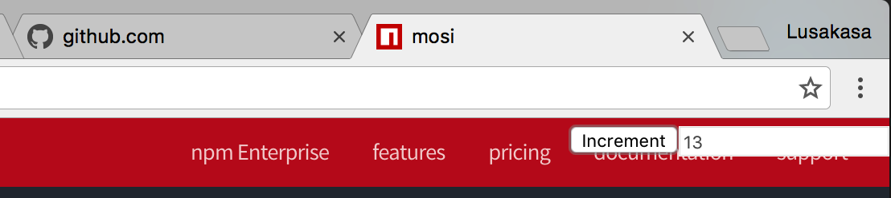

# Mosi

Mosi is a library that simplifies Chrome extension messaging. No more setting up connections, sending messages and attaching listeners. Mosi makes communication organized and intuitive through a declarative, event-driven, pub/sub API.

# Warning

This library is still being developed. Some features work. Others don't. This Readme documents what the library should do. It doesn't actually do it all yet.

# Index

* [Quick Example - A Counter Extension]()
* [Install]()
* [API]()
* [Examples]()
* [Considerations and Limitations]()
* [Contributing]()


# Quick Example - A Counter Extension

This is the source code for an extension that displays a count on every tab. The count starts at 0 and can be incremented by pressing a button. All tabs share the same count so that when the count is incremented from one tab, the change is synchronized to all other tabs.



## background_page.js

```javascript
import { init, net, src } from 'mosi/bp';

let count = 0;

init({
  actions: {
    INCREMENT: (increment = 1) => {
      count += increment;
      net('count').msg('NEW_COUNT', count);
    },
    COUNT: () => {
      net(src()).msg('NEW_COUNT', count);
    }
  }
});
```

The background page stores the count value. It declares two actions that other nodes can trigger: INCREMENT and COUNT.

If INCREMENT is triggered, the count is incremented and a message is sent to every node that subscribes to 'count' with the updated count value.

If COUNT is triggered, it sends a message to the source node that issued COUNT with the current value of count.

## content_script.js

```javascript
import { init, net } from 'mosi/cs';

// Inject Counter GUI into topright of page
const counter = document.createElement('div');
counter.setAttribute('style', 'z-index: 99999; position: fixed; top: 0; right: 0;');
counter.innerHTML = '<button id="increment">Increment</button><input id="count" disabled/>';
document.body.appendChild(counter);

init({
  subscriptions: ['count']
  onConnect: [{ action: 'COUNT' }]
  actions: {
    NEW_COUNT: (count) => {
      document.getElementById('count').value = count;
    }
  }
});

// Add Click listener to increment count
document.getElementById('increment').addEventListener('click', () => {
  net('bp').msg('INCREMENT');
});
```

The content script injects an increment button and counter into each page. It subscribes to 'count' to receive all actions issued via net('count'). It specifies that the background page should execute the COUNT action on connection. It declares a single action, NEW_COUNT, which updates the displayed count with the given count.  It then adds a listener to the increment button that sends an INCREMENT message to the background page.

Targeting the background page with net('bp') is possible because the background page automatically subscribes to 'bp'. Similarly, content scripts automatically subscribe to 'cs'. Although it would have been possible to use net('cs') to send count information, using an explicit 'count' subscription makes it easy to add new targets like the popup or a devtool.

# Install

## Option 1. NPM


```
npm install --save mosi
```

This exposes the following modules:

* mosi/bp - background page
* mosi/cs - content scripts
* mosi/dt - devtools
* mosi/ep - extension pages, e.g. settings or custom pages

You can then import from the appropriate module.

```javascript
import { init, net } from 'mosi/dt';
init({ actions: { NADA: () => {} } });
net('bp').msg('HELLO');
```

Your extension will not work if you import from the wrong module, e.g. import mosi/bp from a content script.

## Option 2. Pre-compiled .js files

Download the pre-compiled files from this repo's dist directory. Make sure to attach the correct bundle in your manifest.json.

* mosi.bp.js - background page
* mosi.cs.js - content scripts
* mosi.dt.js - devtools
* mosi.ep.js - extension pages, e.g. settings or custom pages

You can then make calls through the mosi object.

```javascript
mosi.init(actions, subscriptions);
mosi.net('bp').msg('HELLO');
```

Your extension will not work if you bundle the wrong .js file in your manifest.json, e.g. include mosi.bp.js instead of mosi.cs.js in your content scripts.

# API

Mosi exports three functions: `init`, `net` and `src`. This documentation needs updating.

## init

```
(config: {
  subscriptions?: string[];
  onConnect?: ActionDetails[];
  onDisconnect?: ActionDetails[];
  actions: { [key: string]: Action };
}) => void;
```

* `actions` - the actions the node exposes
* `subscriptions` - a node's subscriptions

Initializes Mosi with the given actions and subscriptions. No messages can be sent or received until `init` is called. After initialization, a node will receive any message targeting any of its subscriptions. This message will be handled by the appropriate action. If a matching action does not exist, the node logs an error to the console.

### Actions

```
(src: string) => {
  [key: string]: (arg?: any) => void
}
```

Actions declares the actions to be executed when a message is received. It is structured as a function that accepts a src string, where src refers to the node that issued the action, and returns an object whose members are functions that can be called when messages are received.

In the counter example, `net('bp').msg('COUNT')` is used to fetch the starting value of count from the background page. The background page handles the request using the action `COUNT: () => { net(src).msg('NEW_COUNT', count); }`, which is able to send a response back to the correct content script using the src string. 

### Subscriptions

```
string[]
```

A node's subscriptions declare that it should get a message whenever a message is sent to one if its subscriptions.

Note that every node is initialized with a default subscription corresponding to its class, e.g. the background page is initialized with subscription 'bp' and content scripts are initialized with subscription 'cs'. Manually subscribing to any default subscription is an  error.

Default subscriptions:
* `'bp'` - background page
* `'cs'` - content scripts
* `'ep'` - extension page
* `'dt'` - devtool
* `'popup'` - popup
* ... suggest other targets in an issue or submit a pull request

## net

```
(dst: string) => Communicator
(dst: Object) => Communicator // in progress
```

*  dst - the destination to which any 

The dst argument can be one of
* `src` - available only with the action's declaration, the node that triggered the action
* `'self'` - the local node, use this to execute actions locally
* A subscription

The net function's only argument is the destination. The destination can be either a subscription string or a Target Object.

net('some_subscription') - Targets all nodes that have declared the subscription, including the source node if it has declared the subscription. A single message is sent to the background page, which then sends the messages to all subscribed nodes.

The net function's only argument is the target. The target can a built-in target or a subscription group. The built in target groups are:

### Communicator

```
{
  msg: (type: string, arg?: any) => void,
  get: (type: string, arg?: any) => Promise<any[]> // in progress
}
```

#### msg

msg sends a message to the target group. The user supplies an action and an optional argument to send to the target group. The receiving nodes of the target group must contain handlers for the specified action. Under the hood, msg works by sending a single message to every node of the target group.

#### get

get is like msg, except it returns a value. Specifically, it returns a Promise on the value returned by the specified action. Because a target comprises multiple nodes, the promise value is acually a list of values, one for each target node.

```javascript
const [count] = await net("bp").get("COUNT");
```

# Examples

* [Counter]()
* and more...

# Considerations and Limitations

1. Mosi emphasizes ease-of-use over performance. It's magical API requires serious work under the hood. See benchmark [fill in].
2. Mosi requires a persistent background page. An non-persistent background page, aka an event page, won't work.
3. Mosi uses a star architecture in which all messages are sent to the background page, which then forwards the message to all subscribed nodes.
4. Mosi uses es6 features directly with no precompilation because it is designed for Chrome Extensions, and Chrome supports es6.
5. Mosi is awesome.

Note that Mosi has not been optimized for performance and there is significant leeway to improve it. 

# Contributing

All contributions welcome.

If you encounter a bug, create an issue. If you're amazing, fix it and submit a pull request.

If you have any suggestions, create an issue for discussion.

Mosi's API is minimal and simple, but may be a little inflexible given a node's actions and subscriptions are declared statically. If you can provide a use case for dynamic actions and subscriptions and an elegant API, please create an issue.